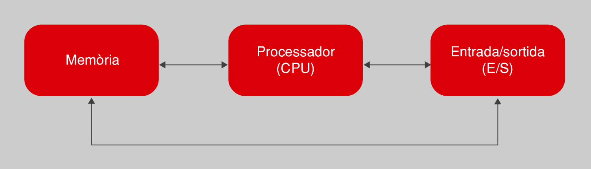
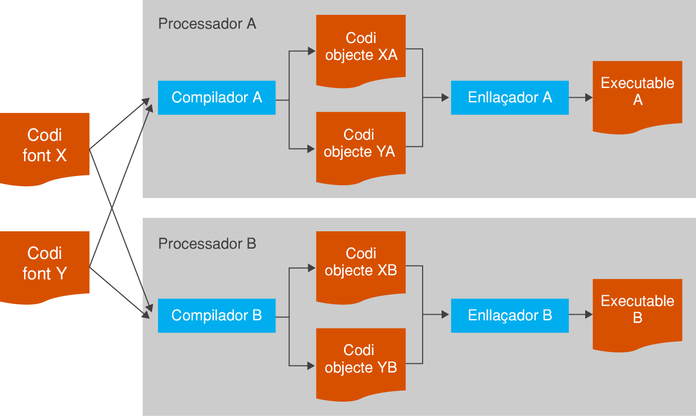
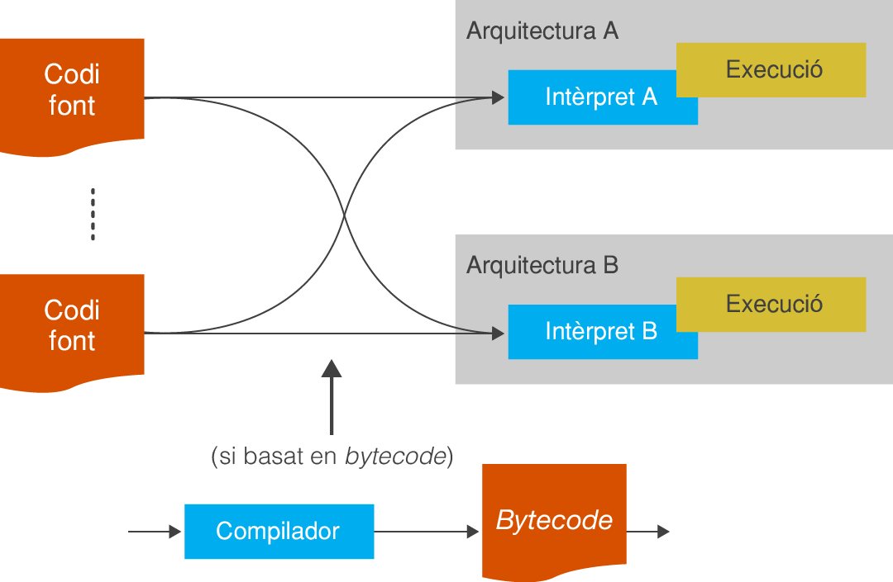
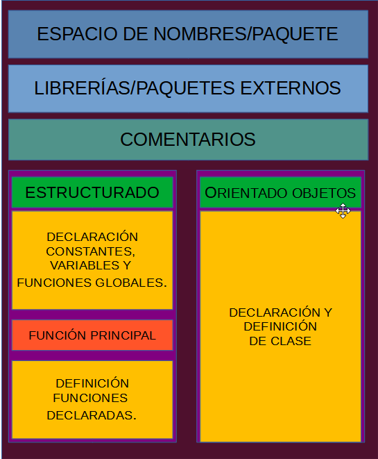
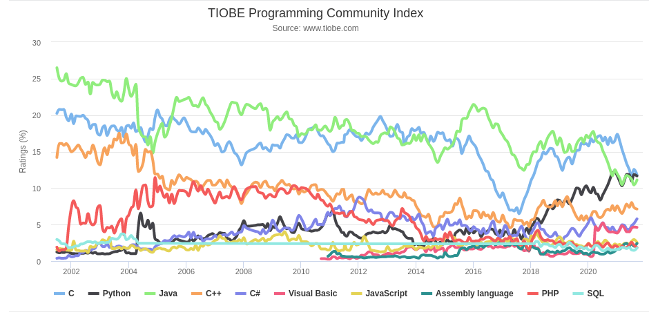

Iniciació a la programació
============================

Com en qualsevol procés daprenentatge, cal començar pel principi. És important tenir clars un conjunt de conceptes bàsics que ajudin a comprendre els conceptes més avançats que vindran posteriorment. En aquest cas, es tracta d'establir què és un programa, com funciona i què és el model general per crear-ne un. Només una vegada ho tingueu clar us podeu plantejar seure davant l'ordinador i començar a programar.

Què és un programa?
--------------------

Un primer pas per poder començar a estudiar com cal fer un programa informàtic és tenir clar què és un programa. En contrast amb altres termes usats en informàtica, és possible referir-se a un “programa” en el llenguatge col·loquial sense haver d'estar parlant necessàriament d'ordinadors. Us podríeu estar referint al programa d'un cicle de conferències o de cinema. Però, tot i no tractar-se d'un context informàtic, aquest ús ja us aporta una idea general del significat: un conjunt d'esdeveniments ordenats de manera que succeeixen de manera seqüencial en el temps, un darrere l'altre.

Un altre ús habitual, ara ja sí vinculat al context de les màquines i els autòmats, podria ser per referir-se al programa d'una rentadora o d'un robot de cuina. En aquest cas, però, el que passa és un conjunt no tant d'esdeveniments, sinó d'ordres que l'electrodomèstic segueix ordenadament. Un cop seleccionat el programa que volem, l'electrodomèstic fa totes les tasques corresponents de manera autònoma.

Per exemple, el programa d'un robot de cuina per fer una crema de blat de moro seria:

1. Espera que introduïu blat de moro i mantega.
2. Gira durant un minut, avançant progressivament de la velocitat 1 a la 5.
3. Espera que introduïu llet i sal.
4. Gira durant 30 segons a velocitat 7.
5. Gira durant 10 minuts a velocitat 3 mentre cou a una temperatura de 90 graus.
6. Es para. La crema està llesta!

Aquest conjunt d'ordres no és arbitrari, sinó que serveix per fer una tasca de certa complexitat que no es pot fer d'un sol cop. Cal fer-ho pas a pas. Totes les ordres estan vinculades entre si per arribar a assolir aquest objectiu i, sobretot, és molt important l'ordre en què es duen a terme.

Entrant ja, ara sí, al món dels ordinadors, la manera com s'estructura el tipus de tasques que aquests poden fer té molt en comú amb els programes d'electrodomèstics. En aquest cas, en lloc de transformar ingredients (o rentar roba bruta, si fos una rentadora), el que l'ordinador transforma és informació o dades.

> Un _programa informàtic_ no és més que una sèrie d'ordres que es duen a terme seqüencialment, aplicades sobre un conjunt de dades.

Quines dades processa un programa informàtic? Bé, això dependrà del tipus de programa:

* Un editor processa les dades dun document de text.
* Un full de càlcul processa dades numèriques.
* Un videojoc processa les dades que diuen la forma i ubicació d'enemics i jugadors, etc.
* Un navegador web processa les ordres de lusuari i les dades que rep des dun servidor a Internet.

Per tant, la tasca d‟un programador informàtic és escollir quines ordres constituiran un programa d‟ordinador, en quin ordre s‟han de dur a terme i sobre quines dades cal aplicar-les, perquè el programa dugui a terme la tasca que ha de resoldre . La dificultat de tot serà més gran o més petita depenent de la mateixa complexitat d'allò que cal que el programa faci. No és el mateix establir què ha de fer lordinador per resoldre una multiplicació de tres números que per processar textos o visualitzar pàgines a Internet.

> **Executar un programa**
>
> Per executar un programa s'entén fer que l'ordinador segueixi totes les seves ordres, des de la primera fins a l'última.

D'altra banda, un cop fet el programa, cada cop que l'executeu, l'ordinador complirà totes les ordres del programa.

De fet, un ordinador és incapaç de fer absolutament res per si mateix, sempre cal dir què ha de fer. I això se li diu mitjançant lexecució de programes. Tot i que des del punt de vista de l'usuari pot semblar que quan es posa en marxa un ordinador aquest funciona sense executar cap programa concret, cal tenir en compte que el vostre sistema operatiu és un programa que està sempre en execució.

Tipus d'ordres que accepten un ordinador
---------------------------------------
Per dur a terme la tasca encomanada, un ordinador pot acceptar diferents tipus dordres. Aquestes es troben limitades a les capacitats dels components que el conformen, de la mateixa manera que el programa duna rentadora no pot incloure lordre de gratinar, ja que no té gratinador. Per tant, és important tenir present aquest fet per saber què es pot demanar a l'ordinador quan creeu un programa.

L'estructura interna de l'ordinador es divideix en una sèrie de components, tots comunicats entre si, tal com mostra la figura següent de manera molt simplista, però suficient per començar. Cada ordre dun programa està vinculada duna manera o altra a algun daquests components.

> **Processador**
>
> El processador també és conegut popularment per les sigles en anglès: CPU (Central Processing Unit, unitat central de processament).

El **processador** és el centre neuràlgic de l'ordinador i l'element capaç de dur a terme les ordres de manipulació i transformació de les dades. Un conjunt de dades es poden transformar de moltes maneres, segons les capacitats que ofereix cada processador. Tot i així, hi ha moltes transformacions que tots poden fer. Un exemple és la realització doperacions aritmètiques (suma, resta, multiplicació, divisió), tal com fan les calculadores.

La **memòria** permet emmagatzemar dades mentre aquestes no estan sent directament manipulades pel processador. Qualsevol dada que ha de ser tractada per un programa estarà a la memòria. Mitjançant el programa es pot ordenar al processador que guardi certes dades o que les recuperi en qualsevol moment. Normalment quan es parla de memòria a aquest nivell ens referim a memòria dinàmica o RAM (Random Access Memory, memòria d'accés aleatori). Aquesta memòria no és persistent i un cop acaba l'execució del programa totes les dades amb què tractava s'esvaeixen. Per tant, la informació no es guardarà entre execucions successives diferents d'un mateix programa.

En certs contextos és possible que també ens trobem amb memòria ROM (Read-Only memory, memòria només de lectura). En aquesta, les dades estan predefinides de fàbrica i no es pot emmagatzemar res, només podem llegir el que conté. Val a dir que no és el cas més habitual.

El sistema d'entrada/sortida** (abreujat com a E/S) permet l'intercanvi de dades amb l'exterior de l'ordinador, més enllà del processador i la memòria. Això permet traduir la informació processada en accions de control sobre qualsevol perifèric connectat a lordinador. Un exemple típic és establir una via de diàleg amb lusuari, ja sigui per mitjà del teclat o del ratolí per demanar-li informació, com per la pantalla, per mostrar els resultats del programa. Aquest sistema és clau per convertir un ordinador en una eina de propòsit general, ja que el capacita per controlar tot tipus daparells dissenyats per connectar-se.

Una altra possibilitat important de lordinador, ateses les limitacions del sistema de memòria, és poder interactuar amb el maquinari demmagatzematge persistent de dades, com un disc dur.

> **Un ordinador és com una pizzeria**
>
> Si voleu fer un símil amb el nostre món de cada dia, un ordinador és com la cuina d'una pizzeria que accepta comandes telefòniques. Fer una comanda equival a demanar l‟inici de l‟execució d‟un programa. Per dur a terme aquesta comanda, cal manipular una sèrie d'ingredients, que representarien les dades. El cuiner amb els seus estris (forn, pastador, etc.) serien el processador, ja que manipulen i transformen els ingredients. La nevera, els armaris o els contenidors, d'on el cuiner pot treure ingredients o on els pot guardar mentre no els manipula, representarien la memòria. El sistema d'entrada/sortida serien els elements de comunicació amb l'exterior de la pizzeria, com el motorista que porta la pizza o el telèfon que el cuiner pot utilitzar per demanar que us portin nous ingredients quan s'acaben, demanar informació addicional a l'usuari (“S'ha acabat el pebrot, va bé si posem ceba?”), o avisar-lo d'algun esdeveniment (“Em sap greu, trigarà una mica més del previst”). De fet, continuant amb el símil, el cuiner prepara una pizza seguint un conjunt de passes. En aquest cas, la recepta són les ordres que ha de seguir el programa. I si el cuiner no té la recepta no pot fer la comanda.
>
> **Llenguatge natural**
>
> El llenguatge natural és aquell que fem servir els humans per comunicar-nos habitualment.

Partint d'aquesta descripció de les tasques que pot dur a terme un ordinador segons els elements que el componen, un exemple de programa per multiplicar dos números és el que es mostra a la **Taula.1**. Ho teniu expressat en llenguatge natural. Noteu com les dades han d'estar sempre emmagatzemades a la memòria per poder operar.

**Taula 1** Un programa que multiplica dos números usant llenguatge natural

|Ordre per donar|Element que ho efectua|
|---------------|----------------------|
|1\. Llegeix un número del teclat|E/S (teclat)|
|2\. Desa del número en memòria|Memòria|
|3\. Llegeix un altre número del teclat|E/S (teclat)|
|4\. Desa del número en memòria|Memòria|
|5\. Recupera els números de la memòria i fa la multiplicació|Processador|
|6\. Desa el resultat en memòria|Memòria|
|7\. Mostra el resultat a la pantalla|E/S (pantalla)|

Crear un programa executable…
-----------------------------

Per crear un programa cal establir quines ordres s'han de donar a l'ordinador i en quina seqüència. Ara bé, avui dia els ordinadors encara no entenen el llenguatge natural (com s'utilitza a la **taula.1**), ja que és ple d'ambigüitats i aspectes semàntics que poden dependre del context.

> **Artificial** Per artificial entenem allò que no ha evolucionat a partir de l'ús entre humans, sinó que ha estat creat expressament, en aquest cas per ser utilitzat amb els ordinadors.
>
> **Llenguatge de programació** Per especificar les ordres que ha de seguir un ordinador el que es fa servir és un llenguatge de programació. Es tracta d'un llenguatge artificial dissenyat expressament per crear algoritmes que puguin dur a terme l'ordinador.

Com hi ha moltes llengües diferents, també hi ha molts llenguatges de programació, cadascun amb les seves característiques pròpies, que els fan més o menys indicats per resoldre uns tipus de tasques o d'altres. Tots tenen una sintaxi molt definida, que cal seguir perquè l'ordinador interpreti correctament cada ordre que se li dóna. És exactament el mateix que passa amb les llengües del món: per expressar els mateixos conceptes, el castellà i el japonès usen paraules i normes de construcció gramatical totalment diferents entre si.

> En un llenguatge de programació determinat, l'agrupació d'ordres concretes que es demana a l'ordinador que feu s'anomena **conjunt d'instruccions**.

Normalment, el conjunt d‟instruccions d‟un programa s‟emmagatzema dins d‟un conjunt de fitxers. Aquests fitxers els edita el programador (vosaltres) per crear o modificar el programa. Per als programes més senzills n'hi ha prou amb un únic fitxer, però per als més complexos en poden fer falta més d'un.

Els llenguatges de programació es poden classificar en diferents categories segons les característiques. De fet, algunes de les propietats del llenguatge de programació tenen conseqüències importants sobre el procés que cal seguir per poder crear un programa i per executar-lo. Hi ha dues maneres de classificar els llenguatges de programació (aquestes dues categories no són mútuament excloents):

* Segons si es tracta d'un **llenguatge compilat o interpretat**. Aquesta propietat afecta els passos que cal seguir per arribar a obtenir un fitxer executable. O sigui, un fitxer amb el mateix format que el de les aplicacions que podeu tenir instal·lades al vostre ordinador.
* Segons si es tracta d'un **llenguatge de nivell alt o baix**. Aquesta propietat indica el grau d'abstracció del programa i si les vostres instruccions estan més o menys estretament vinculades al funcionament del maquinari d'un ordinador.

### …en llenguatge màquina
El llenguatge màquina o codi màquina és el llenguatge que triaríem si volguéssim fer un programa que treballés directament sobre el processador. És interessant conèixer perquè ajuda a entendre el procés de generació d'un programa.

En aquest llenguatge, cadascuna de les instruccions es representa amb una seqüència binària, en zeros (0) i uns (1), i tot el conjunt d'instruccions del programa queda emmagatzemat de manera consecutiva dins un fitxer de dades en binari. Si ho intenteu obrir amb un editor de text, el que veureu a la pantalla són símbols totalment incomprensibles.

> **Transistor**
>
> El transistor és el component bàsic d‟un sistema digital. Es pot considerar com un interruptor, en què 1 indica que passa corrent i 0 que no passa.

Quan es demana lexecució dun programa en llenguatge màquina, aquest es carrega a la memòria de lordinador. Tot seguit, el processador va llegint una per una cadascuna de les instruccions, les descodifica i les converteix en senyals elèctrics de control sobre els elements de l'ordinador perquè facin la tasca demanada. A nivell molt baix, gairebé es pot arribar a establir una correspondència entre els 0 i 1 de cada instrucció i l'estat resultant dels transistors dins dels xips interns del processador.

El conjunt d'instruccions que és capaç de descodificar correctament un processador i convertir senyals de control és específic per a cada model i està definit pel seu fabricant. El dissenyador de cada processador es va inventar la sintaxi i les instruccions del codi màquina dacord amb les seves necessitats quan va dissenyar el maquinari. Per tant, les instruccions en format binari que pot descodificar un tipus de processador poden ser totalment incompatibles amb les que en pot descodificar un altre. Això és lògic, ja que els seus circuits són diferents i, per tant, els senyals elèctrics de control que ha de generar són diferents per a cada cas. Dues seqüències de 0 i 1 iguals poden tenir efectes totalment diferents en dos processadors de models diferents o resultar incomprensibles per a algun.

> Un programa escrit en llenguatge de màquina és específic per a un tipus de processador concret. No es pot executar sobre cap altre processador, llevat que siguin compatibles. Un processador concret només entén directament el llenguatge de màquina especificat pel fabricant.

Tot i que, com es pot veure, en realitat hi ha molts llenguatges màquina diferents, es fa servir aquesta terminologia per englobar-los a tots. Si es vol concretar més, es pot dir “llenguatge màquina del processador X”.

Ara bé, estrictament parlant, si optéssiu per fer un programa en llenguatge de màquina, mai ho faríeu generant directament fitxers amb tot seqüències binàries. Us heu d'imaginar només l'aspecte d'un programa d'aquest tipus en format imprès, consistent en un enorme reguitzell de 0 i 1. Seria totalment incomprensible i pràcticament impossible d'analitzar. En realitat el que es fa servir és un sistema auxiliar de mnemotècnics en el qual s'assigna a cada instrucció en binari un identificador en format de text llegible, més fàcilment comprensible per als humans. D'aquesta manera, es pot generar un programa a partir de fitxers en format text.

> Aquesta compilació de mnemotècnics és el que es coneix com el **llenguatge assemblador.**

A títol il·lustratiu, la **taula.2** mostra les diferències d'aspecte entre un llenguatge màquina i assemblador equivalents per a un processador de model 6502. Sense entrar en més detalls, és important esmentar que tant en llenguatge màquina com en assemblador cadascuna de les instruccions es correspon a una tasca molt simple sobre un dels components. Fer que lordinador faci tasques complexes implica haver de generar moltes instruccions en aquests llenguatges.

**Taula 2.** Taula d'equivalència entre llenguatge assemblador i llenguatge màquina.

|
Instrucció assemblador
|
Llenguatge màquina
|
|----------------------|------------------|
|LDA #6                |1010100100000110  |
|CMP &3500             |110011010000000000110101|
|LDA &70               |1010010101110000  |
|INX                   |11101111          |

### …mitjançant un llenguatge compilat

> **Editors de text simples**
>
> Un editor de text simple és aquell que permet escriure només text sense format. En són exemples el Bloc de Notes (Windows), Gedit o Emacs (Unix).

Per crear un programa el que farem és crear un fitxer i escriure el conjunt d'instruccions que volem que l'ordinador executi. Per començar serà suficient amb un editor de text simple.

> Un cop s'ha acabat d'escriure el programa, el conjunt de fitxers de text resultant on es troben les instruccions que conté s'anomena el codi font**.

Aquest sistema de programar més còmode per als humans fa sorgir un problema, i és que els fitxers de codi font no contenen llenguatge màquina i, per tant, són incomprensibles per al processador. No es pot demanar que l'executi directament; això només és possible usant llenguatge màquina. Per poder generar codi màquina cal fer un procés de traducció des dels mnemotècnics que conté cada fitxer a les seqüències binàries que entén el processador.

> El procés anomenat **compilació** és la traducció del codi font dels fitxers del programa en fitxers en format binari que contenen les instruccions en un format que el processador pot entendre. El contingut d'aquests fitxers s'anomena codi objecte. El programa que fa aquest procés s'anomena **compilador**.

Per al cas de l'assemblador el procés de compilació és molt senzill, ja que és una mera traducció immediata de cada mnemotècnic a la seqüència binària que li correspon. En principi, amb això ja n'hi hauria prou per poder fer qualsevol programa, però cenyir-se només a l'ús de llenguatge assemblador comporta certs avantatges i inconvenients que fan que en realitat no sigui usat normalment, només en casos molt concrets.

Pel costat positiu, amb assemblador el programador té control absolut del maquinari de lordinador a nivell molt baix. Pràcticament es pot dir que controla cada senyal elèctric i els valors dels transistors dins dels xips. Això permet arribar a fer programes molt eficients en què l'ordinador fa exactament allò que li dieu sense cap mena d'ambigüitat. En contraposició, els programes en assemblador només funcionen per a un tipus de processador concret, no són portables. Si s'han de fer per a una altra arquitectura, normalment cal començar de zero. A més —i és el motiu de més pes per pensar-s'ho dues vegades si es vol fer servir aquest llenguatge— crear un programa complex requereix un grau enorme d'experiència sobre com funciona el maquinari del processador, i el treball seria considerable. Això fa que siguin programes complicats d'entendre i que calgui dedicar molt de temps a fer-los.

#### Llenguatges compilats d'alt nivell

> **Programes de baix nivell**
>
> Es considera que el codi màquina i l'assemblador són els llenguatges de nivell més baix existents, ja que les instruccions depenen directament del tipus de processador.

Actualment, per generar la immensa majoria de programes s'utilitzen els anomenats llenguatges d'alt nivell. Aquests ofereixen un conjunt d'instruccions fàcils d'entendre per a l'ésser humà i, per tant, tenen un grau d'abstracció més alt que el llenguatge assemblador (ja que no estan vinculats a un model de processador concret). Cadascuna de les instruccions es correspon a una ordre genèrica en què el més important és el seu aspecte funcional (què es vol fer), sense que importi com es materialitza això al maquinari de l'ordinador ni molt menys en senyals elèctrics. En qualsevol cas, cal advertir que aquesta classificació no sempre és absoluta. Es pot dir que un llenguatge és de nivell més alt o baix que un altre, segons el grau relatiu d'abstracció de les instruccions i la proximitat al funcionament intern del maquinari d'un ordinador.

El procés per generar un programa a partir d'un llenguatge de nivell alt és molt semblant al que cal seguir per fer-ho usant el llenguatge assemblador, ja que les instruccions també s'escriuen en format text dins de fitxers de codi font. L'avantatge addicional és que el format i la sintaxi ja no estan lligats al processador, i per tant, poden tenir el format que vulgui l'inventor del llenguatge sense haver de tenir en compte el maquinari dels ordinadors on s'executarà. Normalment, les instruccions i la sintaxi han estat escollides per facilitar la tasca de creació i comprensió del codi font del programa.

De fet, en els llenguatges de nivell alt més freqüents, entre els quals hi ha el que aprendreu a fer servir en aquest mòdul, les instruccions dins d'un programa s'escriuen com una seqüència de sentències.
> Una **sentència** és l'element mínim d'un llenguatge de programació, sovint identificat per una cadena de text especial, que serveix per descriure exactament una acció que el programa ha de fer.

Per tant, a partir d'ara es farà servir el terme sentència en lloc d'instrucció quan el text es refereixi a un llenguatge d'aquest tipus.

Un cop s'han acabat de generar els fitxers amb el codi font, aquests també s'han de compilar per traduir-los a codi objecte. Ara bé, en aquest cas, el procés de traducció a codi objecte serà força més complicat que des d'assemblador. El compilador dun llenguatge de nivell alt és un programa molt més complex. Pel que fa al procés de compilació, una conseqüència addicional del fet que el llenguatge no depengui directament del tipus de processador és que des d'un mateix codi font es pot generar codi objecte per a diferents processadors. Només cal disposar d'un compilador diferent per a cada tipus de processador que es vol suportar. Per tant, un mateix codi font original pot servir per generar programes que funcionin amb diferents tipus de processador sense haver-lo de modificar cada cop.

Com que per a cada fitxer de codi font es genera un fitxer de codi objecte, després del procés de compilació hi ha un pas addicional anomenat enllaçament (_link_), en el qual aquests dos codis es combinen per generar un únic fitxer executable. Col·loquialment, quan us demanem que compileu un programa ja se sol donar per fet que també s'enllaçarà, si s'escau. Tot i així, formalment es consideren dos passos diferenciats.

La figura següent mostra un esquema que serveix de resum del procés de generació del fitxer executable usant un llenguatge compilat.

Alguns exemples de llenguatges de nivell alt compilats molt populars són C o Pascal. Com hem vist, l'assemblador també és un llenguatge compilat, però de nivell baix.

#### Errors de compilació

El compilador és fonamental per generar un programa en un llenguatge compilat, ja sigui de nivell alt o baix. Per poder fer la seva feina de manera satisfactòria i generar codi objecte a partir del codi font cal que les instruccions segueixin perfectament la sintaxi del llenguatge triat. Per exemple, cal utilitzar només les instruccions especificades al llenguatge i fer-ho en el format adequat. Si no és així, el compilador és incapaç d'entendre l'ordre que es vol donar a l'ordinador i no sap com traduir-lo a llenguatge màquina.

> Quan el compilador detecta que una part del codi font no segueix les normes del llenguatge, el procés de compilació s'interromp i anuncia que hi ha un **error de compilació**

Quan això passa, caldrà repassar el codi font i intentar esbrinar on és l'error. Normalment, el compilador dóna algun missatge sobre el que considera que està malament.
Cal ser conscients que un programador pot arribar a dedicar bona part del temps de la generació del programa a la resolució d'errors de compilació. Ara bé, que un programa compile correctament només vol dir que s'ha escrit d'acord amb les normes del llenguatge de programació, però no aporta cap garantia que sigui correcte, és a dir, que faci correctament la tasca per a la qual s'ha ideat.

> **Els llenguatges de programació i el llenguatge natural**
>
> Intentant fer un símil entre un llenguatge de programació i el llenguatge natural, si una persona que parla castellà és com un compilador, que és capaç d'entendre o traduir una frase sempre que se segueixin les normes d'aquesta llengua, sense una mica d'imaginació se li pot fer difícil entendre la frase: ”gelat kérem un comra”. Hi ha paraules en un ordre estrany, ia més n'hi ha d'altres que no pertanyen al castellà o que no simplement no existeixen…
>
> Per altra banda, la frase “El gelat condueix un full de paper” pot ser gramaticalment correcte i no tenir cap error de sintaxi. Algú que parli castellà la pot entendre. Ara bé, és clar que alguna cosa no encaixa. En la comprensió del significat dun llenguatge hi ha aspectes que van més enllà de la sintaxi, i els llenguatges de programació no són excepció.

### … mitjançant un llenguatge interpretat

En contraposició dels llenguatges compilats, tenim els llenguatges interpretats. En aquest cas, no es fa una distinció interna entre nivell alt i baix, ja que la immensa majoria de llenguatges interpretats són de nivell alt. El que interessa és entendre la idea general del funcionament i les diferències amb els compilats. Com en el cas dels llenguatges compilats, els programes també s'escriuen en fitxers de text que contenen codi font. La divergència sorgeix immediatament després d'acabar-los d'escriure, en la manera com es genera un fitxer executable. El quid de la qüestió és que, precisament, ni es genera cap codi objecte ni cap fitxer executable. Es treballa directament amb el fitxer de codi font. Un cop aquest està escrit, el procés de creació del programa executable ha finalitzat.

> **Intèrpret**
>
> Alerta, un intèrpret no tradueix el codi font del programa a codi objecte i aleshores l'executa. El que fa és executar diferents instruccions del codi propi segons cada instrucció llegida del codi font.
Imagineu un programa que accepta una sèrie de dades que codifiquen unes instruccions, les va llegint una per una i les va processant de manera que actua d'una forma o d'una altra, és a dir, executa una part o una altra del codi objecte segons el tipus d´instrucció llegida. Al cap ia la fi, seria un programa que imita el comportament d'un processador, però a escala de programari. Doncs això és exactament un intèrpret.

> Un llenguatge interpretat s'executa indirectament, mitjançant l'ajuda d'un programa auxiliar anomenat intèrpret, que processa el codi font i en gestiona l'execució.

Igual que en els llenguatges compilats, pot passar que el programador hagi inclòs sense adonar-se'n algun error de sintaxi a les instruccions. En aquest cas, serà lintèrpret qui mostrarà lerror i es negarà a executar el programa fins que hagi estat solucionat.

> Col·loquialment, la generació de bytecode a partir del codi font s'anomena igualment **compilar**.

Alguns llenguatges interpretats usen una aproximació híbrida. El codi font es compila i com a resultat es genera un fitxer de dades binàries anomenades **bytecode**. Aquest bytecode, però, no és formalment codi objecte, ja que no és capaç d'entendre'l el maquinari de cap processador. Només un intèrpret el pot processar i executar. Simplement és una manera demmagatzemar més eficient i en menys espai, en format binari i no en text, les instruccions incloses en el codi font. Aquest és el motiu pel qual, malgrat necessitar un procés de compilació, aquests llenguatges no es consideren realment compilats i es continuen classificant com a interpretats.

Per les seves característiques, els llenguatges interpretats no requereixen un procés d'enllaç posterior.

La figura següent mostra un esquema del procés dexecució dun programa en llenguatge interpretat. Noteu que en el cas d'un llenguatge amb bytecode, allò que es proporciona a l'intèrpret són fitxers amb la versió del codi font prèviament compilat en bytecode, i no el codi font directament.

Entre els llenguatges interpretats més coneguts trobem Javascript, PHP o Perl. Molts són llenguatges de seqüència, que permeten el control d'aplicacions dins d'un sistema operatiu, dur a terme processos per lots (batch) o generar dinàmicament contingut web. Entre els llenguatges interpretats basats en bytecode, Python i Java són els més populars.

Entorns integrats de desenvolupament
---------------------------------

> Un **IDE** (Integrated Development Environment o al voltant integrat de desenvolupament) és una eina que integra tot el que cal per generar programes d'ordinador, de manera que el treball sigui molt més còmode.

Un cop s'ha descrit el procés general per desenvolupar i arribar a executar un programa, es fa evident que cal tenir instal·lats i correctament configurats dos programes completament diferents i independents al vostre ordinador per desenvolupar-los: editor, d'una banda, i compilador (incloent-hi l'enllaçador) o intèrpret per l'altra, segons el tipus de llenguatge. Cada cop que vulgueu modificar i provar el vostre programa haureu d'anar alternant execucions entre tots dos. Realment, seria molt més còmode si tot això es pogués fer des d'un únic programa, que integrés tots tres. Un editor avançat des del qual es pugui compilar, enllaçar si s'escau, i iniciar l'execució de codi font per comprovar si funciona.

> **Exemples d'IDE**
>
> Alguns exemples d'IDE són Visual Studio, per a qualsevol i Visual Basic; Netbeans i Eclipse, per als llenguatges Java i Ruby; Dev-Pascal, per al llenguatge Pascal, o el Dev-C, per al llenguatge C.

La utilització daquestes eines agilitza increïblement el treball del programador. A més, els IDE més moderns van més enllà d'integrar editor, compilador i enllaçador o intèrpret i aporten altres característiques que fan encara més eficient la tasca de programar. Per exemple:

* Possibilitat de fer ressaltar amb codis de colors els diferents tipus d'instruccions o aspectes rellevants de la sintaxi del llenguatge suportat, per facilitar la comprensió del codi font.
* Accés a documentació i ajuda contextual sobre les instruccions i sintaxi dels llenguatges suportats.
* Detecció, i en alguns casos fins i tot correcció, automàtica derrors de sintaxi en el codi, de manera similar a un processador de text. Així, no cal compilar per saber que el programa està malament.
* Suport simultani del desenvolupament de llenguatges de programació diferents.
* Un depurador, una eina molt útil que permet pausar l'execució del programa en qualsevol moment o fer-la instrucció per instrucció, de manera que permet analitzar com funciona el programa i detectar errors.
* En els més avançats, sistemes dajuda per a la creació dinterfícies gràfiques.

En definitiva, fer servir un IDE per desenvolupar programes és una opció molt recomanable. Tot i així, cal tenir present que són programes més complexos que un simple editor de text i, com passaria amb qualsevol altre programa, cal dedicar un cert temps a familiaritzar-se amb aquests i amb les opcions de què disposen.

Elements principals d'un programa
------------------------------------

Els elements principals d‟un programa informàtic clàssic es divideixen en diversos grups depenent del paradigma, del llenguatge i de la finalitat. Per exemple, a C cal l'existència d'un punt d'entrada anomenat main, o en els primers llenguatges de servidor com PHP s'executava el fitxer complet. Tot i la varietat d'elements d'un programa, pràcticament tots tenen els blocs següents:

* **Bloc de declaracions**. Inclou la declaració i normalment la instanciació de tots els objectes i elements a processar com a constants o variables.

* Bloc d'instruccions

 Accions sobre els elements definits al bloc de declaració que permeten assolir l'objectiu del programa. Dins d'aquest es poden diferenciar 3 grups d'instruccions:

 * **Entrada**: La seva funció és obtenir la informació aportada des de l'exterior necessària per fer el processament. Aquesta informació s'emmagatzema als elements definits al bloc de declaracions.
 * **Procés**: Instruccions la finalitat de les quals és assolir l'objectiu del programa a partir de la informació proporcionada a l'entrada.
 * **Sortida**. Un cop realitzats els càlculs, aquest bloc s'encarrega d'emmagatzemar, per exemple en un fitxer o en una base de dades o mostrar-lo en algun dispositiu de sortida com un monitor o impressora.

A la majoria dels llenguatges actuals, a més dels blocs anteriors es tenen també:

* **Espai de nom o paquet.** Indica l'àmbit o abast del codi de manera que es puguin encapsular per al seu ús posterior.
* **Bloc d'ús d'elements externs**. Indica les classes o funcions externes que s'utilitzaran al programa, anomenats llibreries o paquets depenent del llenguatge, per exemple C o Java i que posteriorment seran enllaçats, per exemple a C s'utilitza la paraula reservada #include o Java la paraula import .
* **Bloc de definició del fitxer/classe** en què s'inclouen comentaris com l'autor, el tipus de llicència, l'ús o funció del codi o classe.

El vostre primer programa
-----------------------

Hi ha diferents llenguatges de programació, alguns realment molt diferents entre ells. Abans de seguir endavant cal triar-ne un que serà l'usat per practicar tots els conceptes de programació bàsica que veureu d'ara endavant. Un cop aprengueu a programar en un llenguatge, dominar altres llenguatges us serà molt fàcil, ja que molts dels conceptes bàsics, i fins i tot alguns aspectes de la sintaxi, es mantenen entre diferents llenguatges de nivell alt.

Un llenguatge molt popular semblant a Java és el C. La sintaxi del Java està clarament basada en aquest llenguatge.

La gràfica següent mostra la rellevància dels llenguatges de programació existents.

Font: [https://www.tiobe.com/tiobe-index/](https://www.tiobe.com/tiobe-index/)

Guia instal·lació LAMP:
[https://www.digitalocean.com/community/tutorials/how-to-install-lamp-stack-on-ubuntu](https://www.digitalocean.com/community/tutorials/how-to-install-lamp-stack-on-ubuntu)
